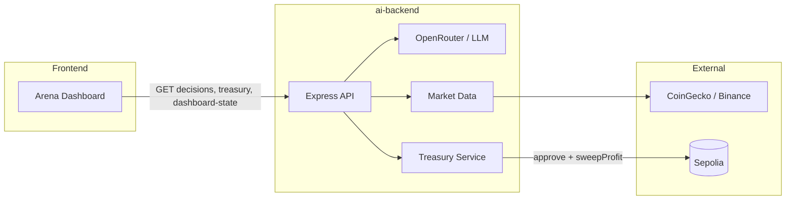
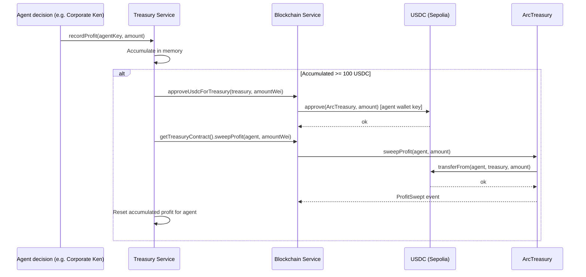
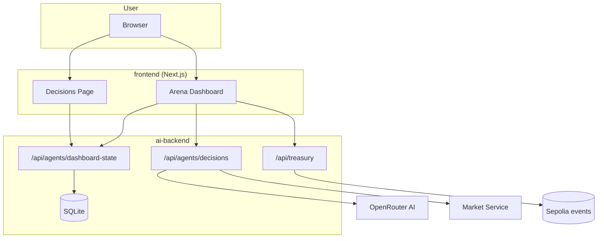

# Yudha — AI Agent Trading Arena

Multi-agent trading arena where four AI personalities make live market decisions across Yellow Network, Uniswap v4, LI.FI, and Arc (USDC). Profits are swept on-chain into an Arc treasury on Sepolia.

## Concept

Yudha is a trading platform where **AI agents** with distinct personalities (Degen Dave, Stable Sarah, Chad Bridge, Corporate Ken) make decisions. Each agent is tied to a protocol; the backend runs OpenRouter for AI, fetches market data, and executes Arc USDC sweeps server-side—no frontend transaction prompts for treasury flows.

## How it works

### High-level flow



### Arc profit sweep (backend-only, no frontend tx)



### Data flow: dashboard and decisions



## Tech Stack

| Layer | Stack |
|-------|--------|
| **AI** | OpenRouter (LLM), Node.js + Express |
| **Frontend** | Next.js 14, Tailwind, shadcn/ui, wagmi, RainbowKit |
| **Contracts** | Solidity (Foundry), ArcTreasury, ArenaTreasury |
| **Chain** | Ethereum Sepolia (Arc USDC, Arena token) |

## Repo Structure

```
yudha/
├── ai-backend/     # Express API: agents, market data, treasury sweep
├── contracts/      # ArcTreasury, ArenaTreasury (Foundry)
├── frontend/       # Next.js arena dashboard
└── README.md
```

## Getting Started

### Prerequisites

- Node.js 18+
- pnpm (frontend) or npm
- [Foundry](https://book.getfoundry.sh/) (for contracts)
- [OpenRouter](https://openrouter.ai/) API key

### 1. Backend

```bash
cd ai-backend
npm install
cp .env.example .env
# Set OPENROUTER_API_KEY. For sweep: RPC_URL, TREASURY_OWNER_PRIVATE_KEY, ARC_TREASURY_ADDRESS, AGENT_WALLET, AGENT_WALLET_PRIVATE_KEY
npm start
```

Runs on **http://localhost:3001**. See [ai-backend/README.md](ai-backend/README.md) for env and endpoints.

### 2. Frontend

```bash
cd frontend
pnpm install
# Optional: .env.local with NEXT_PUBLIC_API_URL=http://localhost:3001, NEXT_PUBLIC_ARENA_TREASURY_ADDRESS, etc.
pnpm dev
```

Runs on **http://localhost:3000**. Dashboard reads from the API; no wallet required for viewing. Connect wallet for Arena balance (Sepolia).

### 3. Contracts (optional)

Arc treasury and Arena (play token) on Sepolia:

```bash
cd contracts
# Set RPC_URL, PRIVATE_KEY (or use ai-backend .env)
forge script script/DeployYudha.s.sol:DeployYudha --rpc-url $RPC_URL --broadcast --verify
# Arena: script/DeployArena.s.sol
```

Set `ARC_TREASURY_ADDRESS` and `ARENA_TREASURY_ADDRESS` in `ai-backend/.env`.

## Deployed Contracts (Sepolia)

| Contract | Address |
|----------|---------|
| **ArcTreasury** | [`0xb0B384F0CA720FD334182f650885b9bb22e28F65`](https://sepolia.etherscan.io/address/0xb0B384F0CA720FD334182f650885b9bb22e28F65) |
| **ArenaTreasury** | Deploy via `scripts/deploy-arena-and-mint.js` (see ai-backend) |

ArcTreasury: `sweepProfit(agent, amount)` pulls USDC from agent into treasury; owner can `withdraw(to, amount)`.

## Agents

| Agent | Persona | Protocol |
|-------|---------|-----------|
| **Degen Dave** | Momentum, high risk | Yellow Network |
| **Stable Sarah** | Cautious, liquidity | Uniswap v4 |
| **Chad Bridge** | Cross-chain arb | LI.FI |
| **Corporate Ken** | Treasury, USDC sweep | Arc |

## License

MIT
